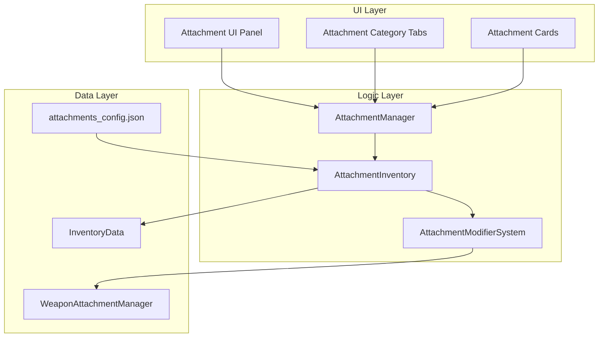
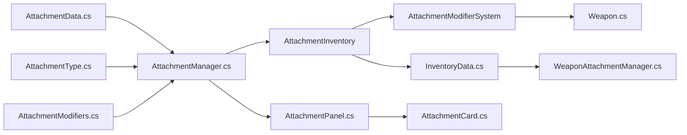

# План реализации системы обвесов оружия

## Обзор

Система обвесов позволяет игрокам покупать, выбирать и устанавливать модификации для оружия. Обвесы изменяют характеристики оружия и визуально отображаются на модели оружия.

## Архитектура системы



## Типы обвесов

| Тип | Описание | Модификаторы |
|-----|----------|--------------|
| Scope | Прицел | Accuracy+, Range+ |
| Muzzle | Надульник | Accuracy+, Damage- |
| Laser | Лазерный целеуказатель | Accuracy+ |
| Grip | Цевье/Рукоятка | Accuracy+, ReloadTime- |
| Magazine | Магазин | MagazineCapacity+, ReloadTime+ |
| Bipod | Сошки | Accuracy+, FireRate- |

## Детальный план реализации

### 1. Создание структуры данных для обвесов в JSON формате

**Файл:** `Assets/Data/attachments_config.json`

Структура JSON файла:

```json
{
  "attachments": {
    "scope_red_dot": {
      "attachmentId": "scope_red_dot",
      "attachmentName": "Красная точка",
      "attachmentType": "Scope",
      "cost": 500,
      "description": "Компактный коллиматорный прицел",
      "prefabPath": "Assets/Prefabs/Attachments/Scope_RedDot.prefab",
      "iconPath": "Assets/UI/Icons/Attachments/scope_red_dot.png",
      "modifiers": {
        "accuracyMultiplier": 0.9,
        "rangeMultiplier": 1.1
      },
      "compatibleWeapons": ["handgun_01", "handgun_02", "smg_01", "ar_01"]
    },
    "muzzle_compensator": {
      "attachmentId": "muzzle_compensator",
      "attachmentName": "Компенсатор",
      "attachmentType": "Muzzle",
      "cost": 300,
      "description": "Уменьшает отдачу при стрельбе",
      "prefabPath": "Assets/Prefabs/Attachments/Muzzle_Compensator.prefab",
      "iconPath": "Assets/UI/Icons/Attachments/muzzle_compensator.png",
      "modifiers": {
        "accuracyMultiplier": 0.95,
        "damageMultiplier": 0.9
      },
      "compatibleWeapons": ["handgun_01", "smg_01", "ar_01"]
    }
  }
}
```

**Задачи:**
- [ ] Создать файл `attachments_config.json`
- [ ] Определить структуру обвесов для всех 6 типов
- [ ] Добавить примеры обвесов для каждого типа
- [ ] Определить совместимость обвесов с оружием

### 2. Создание C# классов для работы с данными обвесов

**Файлы:**
- `Assets/Infima Games/Low Poly Shooter Pack/Code/Attachments/AttachmentData.cs`
- `Assets/Infima Games/Low Poly Shooter Pack/Code/Attachments/AttachmentType.cs`
- `Assets/Infima Games/Low Poly Shooter Pack/Code/Attachments/AttachmentModifiers.cs`

**AttachmentType.cs:**
```csharp
public enum AttachmentType
{
    Scope,
    Muzzle,
    Laser,
    Grip,
    Magazine,
    Bipod
}
```

**AttachmentModifiers.cs:**
```csharp
[System.Serializable]
public class AttachmentModifiers
{
    [Tooltip("Множитель урона")]
    public float damageMultiplier = 1.0f;
    
    [Tooltip("Множитель скорострельности")]
    public float fireRateMultiplier = 1.0f;
    
    [Tooltip("Фиксированное изменение ёмкости магазина")]
    public int magazineCapacityFixed = 0;
    
    [Tooltip("Множитель времени перезарядки")]
    public float reloadTimeMultiplier = 1.0f;
    
    [Tooltip("Множитель точности")]
    public float accuracyMultiplier = 1.0f;
    
    [Tooltip("Множитель дальности")]
    public float rangeMultiplier = 1.0f;
}
```

**AttachmentData.cs:**
```csharp
[System.Serializable]
public class AttachmentData
{
    public string attachmentId;
    public string attachmentName;
    public AttachmentType attachmentType;
    public int cost;
    public string description;
    public string prefabPath;
    public string iconPath;
    public AttachmentModifiers modifiers;
    public List<string> compatibleWeapons;
}

[System.Serializable]
public class AttachmentsConfig
{
    public Dictionary<string, AttachmentData> attachments;
}
```

**Задачи:**
- [ ] Создать enum AttachmentType
- [ ] Создать класс AttachmentModifiers
- [ ] Создать класс AttachmentData
- [ ] Создать класс AttachmentsConfig
- [ ] Создать классы для хранения состояния обвесов игрока

### 3. Создание менеджера обвесов (AttachmentManager)

**Файл:** `Assets/Infima Games/Low Poly Shooter Pack/Code/Attachments/AttachmentManager.cs`

**Функционал:**
- Загрузка конфигурации обвесов из JSON
- Получение списка обвесов по типу
- Получение списка обвесов для конкретного оружия
- Проверка совместимости обвеса с оружием
- Получение данных обвеса по ID

```csharp
public class AttachmentManager : MonoBehaviour
{
    private AttachmentsConfig config;
    
    public void LoadConfig();
    public List<AttachmentData> GetAttachmentsByType(AttachmentType type);
    public List<AttachmentData> GetAttachmentsForWeapon(string weaponId);
    public bool IsCompatible(string attachmentId, string weaponId);
    public AttachmentData GetAttachmentData(string attachmentId);
}
```

**Задачи:**
- [ ] Создать класс AttachmentManager
- [ ] Реализовать загрузку JSON конфигурации
- [ ] Реализовать методы фильтрации обвесов
- [ ] Реализовать проверку совместимости
- [ ] Создать Singleton паттерн для глобального доступа

### 4. Интеграция с существующим InventoryData

**Модификация файла:** `Assets/Infima Games/Low Poly Shooter Pack/Code/Character/InventoryData.cs`

**Добавить в InventoryData:**
```csharp
[System.Serializable]
public class WeaponAttachmentsState
{
    public string weaponId;
    public Dictionary<string, bool> purchasedAttachments;
    public Dictionary<AttachmentType, string> equippedAttachments;
}

[System.Serializable]
public class AttachmentInventoryItem
{
    public string attachmentId;
    public bool purchased;
    public string addedTime;
}
```

**Добавить в InventoryData:**
```csharp
[Header("Attachments")]
[Tooltip("Состояние обвесов для каждого оружия")]
public Dictionary<string, WeaponAttachmentsState> weaponAttachments;

[Header("Attachments Definitions")]
[Tooltip("Определения всех обвесов")]
public Dictionary<string, AttachmentData> attachmentDefinitions;
```

**Методы:**
- `bool HasAttachment(string weaponId, string attachmentId)`
- `void PurchaseAttachment(string weaponId, string attachmentId)`
- `void EquipAttachment(string weaponId, AttachmentType type, string attachmentId)`
- `void UnequipAttachment(string weaponId, AttachmentType type)`
- `List<AttachmentData> GetPurchasedAttachments(string weaponId)`
- `Dictionary<AttachmentType, string> GetEquippedAttachments(string weaponId)`

**Задачи:**
- [ ] Создать класс WeaponAttachmentsState
- [ ] Создать класс AttachmentInventoryItem
- [ ] Добавить поля для хранения обвесов в InventoryData
- [ ] Реализовать методы для работы с обвесами
- [ ] Обновить структуру JSON файла инвентаря

### 5. Создание системы модификаторов характеристик

**Файл:** `Assets/Infima Games/Low Poly Shooter Pack/Code/Attachments/AttachmentModifierSystem.cs`

**Функционал:**
- Применение модификаторов к характеристикам оружия
- Расчет итоговых характеристик с учётом всех установленных обвесов
- Отмена модификаторов при снятии обвеса

```csharp
public class AttachmentModifierSystem
{
    public WeaponStats ApplyModifiers(WeaponStats baseStats, List<AttachmentData> attachments);
    public WeaponStats RemoveModifiers(WeaponStats currentStats, AttachmentData attachment);
    public WeaponStats CalculateFinalStats(string weaponId);
}
```

**WeaponStats:**
```csharp
[System.Serializable]
public class WeaponStats
{
    public float damage;
    public int fireRate;
    public int magazineCapacity;
    public float reloadTime;
    public float accuracy;
    public float range;
}
```

**Задачи:**
- [ ] Создать класс WeaponStats
- [ ] Создать класс AttachmentModifierSystem
- [ ] Реализовать логику применения модификаторов
- [ ] Реализовать логику удаления модификаторов
- [ ] Интегрировать с классом Weapon

### 6. Создание UI для выбора и установки обвесов

**Файлы:**
- `Assets/Infima Games/Low Poly Shooter Pack/UI/Attachments/AttachmentPanel.cs`
- `Assets/Infima Games/Low Poly Shooter Pack/UI/Attachments/AttachmentCategoryTab.cs`
- `Assets/Infima Games/Low Poly Shooter Pack/UI/Attachments/AttachmentCard.cs`

**UI структура:**
```
AttachmentPanel
├── Header (название оружия, баланс валюты)
├── CategoryTabs (Scope, Muzzle, Laser, Grip, Magazine, Bipod)
├── AttachmentList (Scroll View)
│   └── AttachmentCard (для каждого обвеса)
│       ├── Icon
│       ├── Name
│       ├── Description
│       ├── Modifiers display
│       ├── Price / "Owned" label
│       └── Button (Buy/Equip/Unequip)
└── Footer (кнопка "Назад")
```

**AttachmentPanel.cs:**
```csharp
public class AttachmentPanel : MonoBehaviour
{
    public void Show(string weaponId);
    public void SetCategory(AttachmentType type);
    public void RefreshUI();
    public void OnAttachmentCardClicked(AttachmentData attachment);
}
```

**AttachmentCard.cs:**
```csharp
public class AttachmentCard : MonoBehaviour
{
    public void SetData(AttachmentData attachment, bool isPurchased, bool isEquipped);
    public void OnBuyClicked();
    public void OnEquipClicked();
    public void OnUnequipClicked();
}
```

**Задачи:**
- [ ] Создать префаб UI панели обвесов
- [ ] Создать префаб карточки обвеса
- [ ] Создать скрипт AttachmentPanel
- [ ] Создать скрипт AttachmentCard
- [ ] Реализовать логику отображения статусов (куплено/не куплено/установлено)
- [ ] Реализовать логику покупки обвесов
- [ ] Реализовать логику установки/снятия обвесов

### 7. Интеграция с WeaponAttachmentManager

**Модификация файла:** `Assets/Infima Games/Low Poly Shooter Pack/Code/Weapons/WeaponAttachmentManager.cs`

**Добавить методы:**
```csharp
public void LoadAttachmentsFromInventory(string weaponId);
public void SetAttachmentIndex(AttachmentType type, int index);
public void ApplyAttachmentModifiers();
```

**Интеграция:**
- При загрузке оружия читать установленные обвесы из инвентаря
- Устанавливать соответствующие индексы в массивах обвесов
- Применять модификаторы к характеристикам оружия

**Задачи:**
- [ ] Добавить методы для загрузки обвесов из инвентаря
- [ ] Реализовать синхронизацию индексов обвесов
- [ ] Реализовать применение модификаторов к Weapon
- [ ] Добавить события для обновления UI при изменении обвесов

### 8. Тестирование и отладка

**Тестовые сценарии:**
1. Загрузка конфигурации обвесов из JSON
2. Отображение списка обвесов для выбранного оружия
3. Покупка обвеса
4. Установка обвеса на оружие
5. Снятие обвеса с оружия
6. Применение модификаторов к характеристикам
7. Визуальное отображение обвесов на оружии
8. Сохранение состояния обвесов в инвентарь

**Задачи:**
- [ ] Создать тестовый набор обвесов
- [ ] Протестировать загрузку конфигурации
- [ ] Протестировать покупку и установку обвесов
- [ ] Протестировать применение модификаторов
- [ ] Протестировать сохранение/загрузку состояния
- [ ] Исправить найденные баги

## Обновленная структура inventory_test.json

```json
{
  "playerId": "test_player",
  "currencyBalance": 10000,
  "currentWeaponId": "handgun_01",
  "maxWeapons": 20,
  "weapons": {
    "handgun_01": {
      "weaponId": "handgun_01",
      "purchased": true,
      "selected": false
    }
  },
  "weaponDefinitions": {
    "handgun_01": {
      "weaponId": "handgun_01",
      "weaponName": "Пистолет 01",
      "weaponType": "Handgun",
      "weaponPrefabPath": "...",
      "weaponIconPath": "...",
      "baseCost": 100,
      "damage": 25,
      "fireRate": 300,
      "magazineCapacity": 12,
      "reloadTime": 1.5,
      "accuracy": 0.15,
      "range": 50
    }
  },
  "weaponAttachments": {
    "handgun_01": {
      "weaponId": "handgun_01",
      "purchasedAttachments": {
        "scope_red_dot": true,
        "muzzle_compensator": true
      },
      "equippedAttachments": {
        "Scope": "scope_red_dot",
        "Muzzle": "muzzle_compensator",
        "Laser": "",
        "Grip": "",
        "Magazine": "",
        "Bipod": ""
      }
    }
  },
  "attachmentDefinitions": {
    "muzzle_compensator": {
      "attachmentId": "muzzle_compensator",
      "attachmentName": "Компенсатор",
      "attachmentType": "Muzzle",
      "cost": 300,
      "description": "Уменьшает отдачу при стрельбе",
      "prefabPath": "Assets/Prefabs/Attachments/Muzzle_Compensator.prefab",
      "iconPath": "Assets/UI/Icons/Attachments/muzzle_compensator.png",
      "modifiers": {
        "damageMultiplier": 1.0,
        "fireRateMultiplier": 1.0,
        "magazineCapacityFixed": 0,
        "reloadTimeMultiplier": 1.0,
        "accuracyMultiplier": 0.95,
        "rangeMultiplier": 1.0
      },
      "compatibleWeapons": ["handgun_01", "handgun_02"]
    },
    "scope_red_dot": {
      "attachmentId": "scope_red_dot",
      "attachmentName": "Красная точка",
      "attachmentType": "Scope",
      "cost": 500,
      "description": "Компактный коллиматорный прицел",
      "prefabPath": "...",
      "iconPath": "...",
      "modifiers": {
        "damageMultiplier": 1.0,
        "fireRateMultiplier": 1.0,
        "magazineCapacityFixed": 0,
        "reloadTimeMultiplier": 1.0,
        "accuracyMultiplier": 0.9,
        "rangeMultiplier": 1.1
      },
      "compatibleWeapons": ["handgun_01", "handgun_02"]
    }
  }
}
```

## Зависимости компонентов



## Порядок реализации

1. Создать структуру данных (JSON + C# классы)
2. Создать AttachmentManager для загрузки и управления данными
3. Интегрировать обвесы в InventoryData
4. Создать систему модификаторов
5. Создать UI для выбора и установки обвесов
6. Интегрировать с WeaponAttachmentManager
7. Тестирование и отладка
