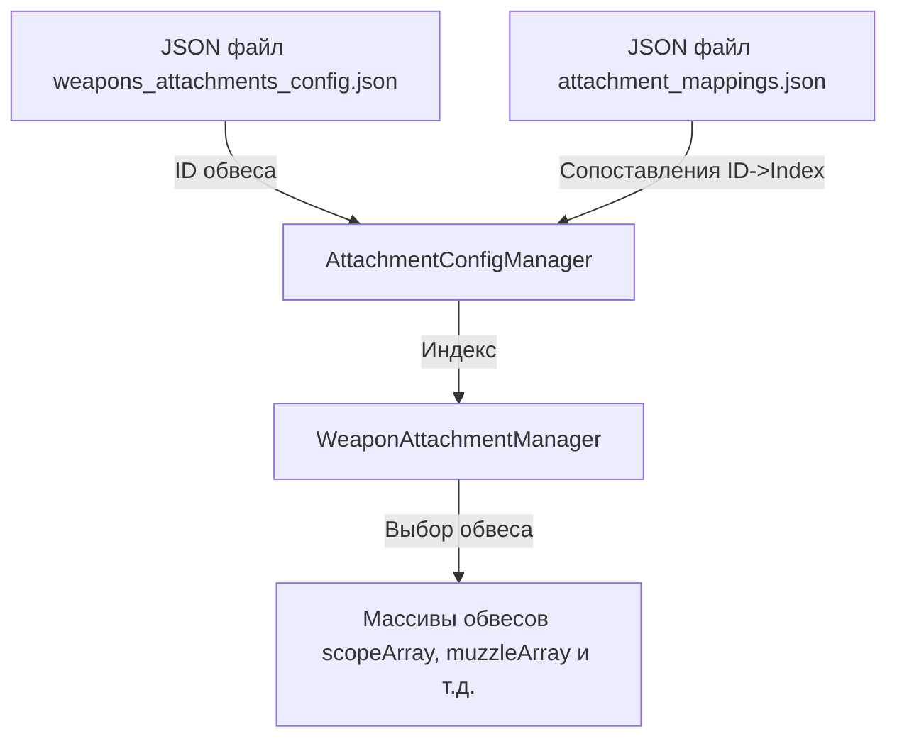

# План рефакторинга системы сопоставлений обвесов

## Обзор

Текущая система требует ручного сопоставления ID обвесов из JSON с индексами массивов через Unity Inspector. Это неудобно, так как:
- При изменении порядка обвесов в массивах индексы меняются
- Нужно вручную обновлять сопоставления в Inspector
- Сложно поддерживать систему контроля версий

**Решение:** Перенести сопоставления в отдельный JSON файл.

---

## Новая архитектура

### 1. Структура JSON файла сопоставлений

Файл: `Assets/Data/attachment_mappings.json`

```json
{
  "version": "1.0",
  "description": "Сопоставление ID обвесов с индексами в массивах WeaponAttachmentManager",
  "mappings": {
    "scopes": [
      {
        "attachmentId": "scope_red_dot",
        "arrayIndex": 0,
        "name": "Red Dot Sight"
      },
      {
        "attachmentId": "scope_acog",
        "arrayIndex": 1,
        "name": "ACOG Scope"
      },
      {
        "attachmentId": "scope_sniper",
        "arrayIndex": 2,
        "name": "Sniper Scope"
      }
    ],
    "muzzles": [
      {
        "attachmentId": "muzzle_compensator",
        "arrayIndex": 0,
        "name": "Compensator"
      },
      {
        "attachmentId": "muzzle_silencer",
        "arrayIndex": 1,
        "name": "Silencer"
      },
      {
        "attachmentId": "muzzle_flash_hider",
        "arrayIndex": 2,
        "name": "Flash Hider"
      }
    ],
    "lasers": [
      {
        "attachmentId": "laser_basic",
        "arrayIndex": 0,
        "name": "Basic Laser"
      },
      {
        "attachmentId": "laser_tactical",
        "arrayIndex": 1,
        "name": "Tactical Laser"
      }
    ],
    "grips": [
      {
        "attachmentId": "grip_vertical",
        "arrayIndex": 0,
        "name": "Vertical Grip"
      },
      {
        "attachmentId": "grip_angled",
        "arrayIndex": 1,
        "name": "Angled Grip"
      }
    ],
    "magazines": [
      {
        "attachmentId": "magazine_standard",
        "arrayIndex": 0,
        "name": "Standard Magazine"
      },
      {
        "attachmentId": "magazine_extended",
        "arrayIndex": 1,
        "name": "Extended Magazine"
      },
      {
        "attachmentId": "magazine_drum",
        "arrayIndex": 2,
        "name": "Drum Magazine"
      }
    ]
  }
}
```

### 2. Классы данных для десериализации

```csharp
/// <summary>
/// Данные сопоставления одного обвеса
/// </summary>
[Serializable]
public class AttachmentMapping
{
    public string attachmentId;
    public int arrayIndex;
    public string name;
}

/// <summary>
/// Группа сопоставлений для типа обвесов
/// </summary>
[Serializable]
public class AttachmentMappingGroup
{
    public List<AttachmentMapping> mappings;
}

/// <summary>
/// Полные данные сопоставлений
/// </summary>
[Serializable]
public class AttachmentMappingsData
{
    public string version;
    public string description;
    
    public Dictionary<string, List<AttachmentMapping>> mappings;
}
```

### 3. Изменения в AttachmentConfigManager

#### Удаляемые поля (строки 43-62):
```csharp
[Header("Сопоставление ID обвесов")]
[Tooltip("Сопоставление ID прицелов с индексами")]
[SerializeField]
private List<AttachmentIdMapping> scopeMappings = new List<AttachmentIdMapping>();

[Tooltip("Сопоставление ID дульных насадок с индексами")]
[SerializeField]
private List<AttachmentIdMapping> muzzleMappings = new List<AttachmentIdMapping>();

// ... остальные поля
```

#### Новые поля:
```csharp
[Header("Пути к JSON файлам")]
[Tooltip("Путь к файлу сопоставлений обвесов")]
[SerializeField]
private string mappingsConfigPath = "Assets/Data/attachment_mappings.json";

private AttachmentMappingsData mappingsData;
```

#### Новый метод загрузки:
```csharp
/// <summary>
/// Загрузить конфигурацию сопоставлений обвесов
/// </summary>
public void LoadMappingsConfig()
{
    try
    {
        if (!System.IO.File.Exists(mappingsConfigPath))
        {
            Debug.LogError($"[AttachmentConfigManager] Файл сопоставлений не найден: {mappingsConfigPath}");
            return;
        }

        string json = System.IO.File.ReadAllText(mappingsConfigPath);
        mappingsData = JsonConvert.DeserializeObject<AttachmentMappingsData>(json);
        
        if (showDebugMessages)
        {
            Debug.Log($"[AttachmentConfigManager] Сопоставления загружены успешно (версия: {mappingsData.version})");
        }
    }
    catch (Exception e)
    {
        Debug.LogError($"[AttachmentConfigManager] Ошибка загрузки сопоставлений: {e.Message}");
    }
}
```

#### Обновленный метод GetAttachmentIndex:
```csharp
/// <summary>
/// Получить индекс обвеса по ID
/// </summary>
public int GetAttachmentIndex(string slotType, string attachmentId)
{
    if (mappingsData == null || !mappingsData.mappings.ContainsKey(slotType))
    {
        Debug.LogWarning($"[AttachmentConfigManager] Тип слота {slotType} не найден в сопоставлениях");
        return -1;
    }

    var mappings = mappingsData.mappings[slotType];
    
    if (showDebugMessages)
    {
        Debug.Log($"[AttachmentConfigManager] Поиск индекса для {slotType}.{attachmentId}");
        Debug.Log($"[AttachmentConfigManager] Доступные сопоставления: {mappings.Count}");
    }

    var mapping = mappings.Find(m => m.attachmentId == attachmentId);
    if (mapping != null)
    {
        if (showDebugMessages)
            Debug.Log($"[AttachmentConfigManager] Найден индекс: {mapping.arrayIndex}");
        return mapping.arrayIndex;
    }

    Debug.LogWarning($"[AttachmentConfigManager] Сопоставление не найдено для {attachmentId}");
    return -1;
}
```

#### Обновление LoadAllConfigs:
```csharp
public void LoadAllConfigs()
{
    AutoDetectCurrentWeapon();

    if (showDebugMessages)
        Debug.Log($"[AttachmentConfigManager] Начало загрузки конфигураций. Текущее оружие: {currentWeaponId}");

    // Сначала загружаем сопоставления
    LoadMappingsConfig();
    
    // Затем загружаем остальные конфигурации
    LoadAvailabilityConfig();
    LoadWeaponsConfig();
    
    // ... остальной код
}
```

### 4. Удаляемые методы

Метод `AddMapping` (строки 486-519) больше не нужен, так как сопоставления теперь в JSON.

Класс `AttachmentIdMapping` (строки 996-1007) можно удалить, если он больше нигде не используется.

---

## Преимущества нового подхода

1. **Единое хранилище:** Все сопоставления в одном JSON файле
2. **Контроль версий:** Легко отслеживать изменения через Git
3. **Автоматизация:** Можно создать скрипты для автоматического обновления
4. **Удобство:** Редактирование без Unity
5. **Масштабируемость:** Легко добавлять новые типы обвесов

---

## Порядок реализации

1. Создать файл `attachment_mappings.json` с примером данных
2. Создать классы данных для десериализации
3. Обновить `AttachmentConfigManager`:
   - Добавить поле для пути к файлу сопоставлений
   - Добавить метод `LoadMappingsConfig()`
   - Обновить `GetAttachmentIndex()` для работы с JSON
   - Обновить `LoadAllConfigs()` для загрузки сопоставлений
4. Удалить поля Inspector для ручного сопоставления
5. Удалить метод `AddMapping()`
6. Протестировать систему

---

## Диаграмма потока данных



---

## Примечания

- При изменении порядка обвесов в массивах нужно обновить только `attachment_mappings.json`
- Рекомендуется добавить валидацию при загрузке (проверка на дубликаты ID)
- Можно добавить автоматическое создание файла сопоставлений, если он не существует
