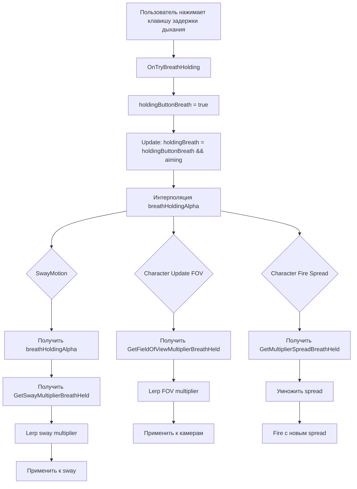

# План реализации задержки дыхания (Breath Holding) для снайперских винтовок

## Обзор требований

На основе предыдущих обсуждений, пользователь хочет:
1. Отключить анимацию покачивания оружия при задержке дыхания
2. Усилить приближение прицела (уменьшить FOV/field of view) при задержке дыхания
3. Уменьшить разброс (spread) при задержке дыхания
4. Больше ничего не нужно

## Технический анализ

### Текущая система

1. **SwayMotion.cs** - управляет покачиванием оружия
   - Использует `scopeBehaviour.GetSwayMultiplier()` для умножения sway

2. **Scope.cs** - содержит настройки прицела
   - `swayMultiplier` - множитель sway при прицеливании
   - `fieldOfViewMultiplierAim` - множитель FOV для мировой камеры
   - `fieldOfViewMultiplierAimWeapon` - множитель FOV для оружия
   - `multiplierSpread` - множитель spread при прицеливании

3. **Character.cs** - основной контроллер персонажа
   - Обрабатывает ввод (InputAction)
   - Управляет FOV камер
   - Вызывает `equippedWeapon.Fire(spreadMultiplier)`

4. **SwayData.cs** - ScriptableObject для настроек sway
5. **ScopeBehaviour.cs** - абстрактный базовый класс для прицелов

## План реализации

### Шаг 1: Добавить множители задержки дыхания в ScopeBehaviour.cs

**Файл:** `Assets/Infima Games/Low Poly Shooter Pack/Code/Weapons/ScopeBehaviour.cs`

**Действия:**
- Добавить абстрактный метод `GetSwayMultiplierBreathHeld()` - возвращает множитель sway при задержке дыхания
- Добавить абстрактный метод `GetFieldOfViewMultiplierBreathHeld()` - возвращает множитель FOV при задержке дыхания
- Добавить абстрактный метод `GetMultiplierSpreadBreathHeld()` - возвращает множитель spread при задержке дыхания

### Шаг 2: Реализовать множители задержки дыхания в Scope.cs

**Файл:** `Assets/Infima Games/Low Poly Shooter Pack/Code/Weapons/Scope.cs`

**Действия:**
- Добавить поле `swayMultiplierBreathHeld` (по умолчанию 0.0) - отключает sway при задержке дыхания
- Добавить поле `fieldOfViewMultiplierBreathHeld` (по умолчанию 0.5) - усиливает приближение
- Добавить поле `multiplierSpreadBreathHeld` (по умолчанию 0.01) - уменьшает разброс
- Реализовать методы:
  - `GetSwayMultiplierBreathHeld()` - возвращает `swayMultiplierBreathHeld`
  - `GetFieldOfViewMultiplierBreathHeld()` - возвращает `fieldOfViewMultiplierBreathHeld`
  - `GetMultiplierSpreadBreathHeld()` - возвращает `multiplierSpreadBreathHeld`

### Шаг 3: Добавить состояние задержки дыхания в Character.cs

**Файл:** `Assets/Infima Games/Low Poly Shooter Pack/Code/Character/Character.cs`

**Действия:**
- Добавить поле `holdingButtonBreath` - отслеживает нажатие клавиши задержки дыхания
- Добавить поле `holdingBreath` - true если персонаж задерживает дыхание (работает только при прицеливании)
- Добавить поле `breathHoldingAlpha` - интерполированное значение (0.0 - 1.0) для плавных переходов

### Шаг 4: Обновить Update() метод в Character.cs

**Файл:** `Assets/Infima Games/Low Poly Shooter Pack/Code/Character/Character.cs`

**Действия:**
- Добавить логику: `holdingBreath = holdingButtonBreath && aiming` - задержка дыхания работает только при прицеливании
- Добавить интерполяцию: `breathHoldingAlpha = Mathf.Lerp(breathHoldingAlpha, holdingBreath ? 1.0f : 0.0f, Time.deltaTime * 8.0f)`
- Обновить FOV логику:
  - Вычислить `breathFieldOfViewMultiplier = Mathf.Lerp(1.0f, equippedWeaponScope.GetFieldOfViewMultiplierBreathHeld(), breathHoldingAlpha)`
  - Применить: `cameraWorld.fieldOfView = Mathf.Lerp(fieldOfView, fieldOfView * equippedWeapon.GetFieldOfViewMultiplierAim() * breathFieldOfViewMultiplier, aimingAlpha) * runningFieldOfView`
  - Применить: `cameraDepth.fieldOfView = Mathf.Lerp(fieldOfViewWeapon, fieldOfViewWeapon * equippedWeapon.GetFieldOfViewMultiplierAimWeapon() * breathFieldOfViewMultiplier, aimingAlpha)`

### Шаг 5: Обновить Fire() метод в Character.cs

**Файл:** `Assets/Infima Games/Low Poly Shooter Pack/Code/Character/Character.cs`

**Действия:**
- Изменить логику spread multiplier:
  ```csharp
  float spreadMultiplier = 1.0f;
  if (aiming)
  {
      spreadMultiplier = equippedWeaponScope.GetMultiplierSpread();
      if (holdingBreath)
          spreadMultiplier *= equippedWeaponScope.GetMultiplierSpreadBreathHeld();
  }
  equippedWeapon.Fire(spreadMultiplier);
  ```

### Шаг 6: Добавить input handler для задержки дыхания

**Файл:** `Assets/Infima Games/Low Poly Shooter Pack/Code/Character/Character.cs`

**Действия:**
- Добавить метод `OnTryBreathHolding(InputAction.CallbackContext context)`
- Обработать фазы Started и Canceled для установки `holdingButtonBreath`

### Шаг 7: Добавить метод GetBreathHoldingAlpha() в CharacterBehaviour.cs

**Файл:** `Assets/Infima Games/Low Poly Shooter Pack/Code/Character/CharacterBehaviour.cs`

**Действия:**
- Добавить абстрактный метод `GetBreathHoldingAlpha()` - возвращает значение alpha (0.0 - 1.0)

### Шаг 8: Реализовать GetBreathHoldingAlpha() в Character.cs

**Файл:** `Assets/Infima Games/Low Poly Shooter Pack/Code/Character/Character.cs`

**Действия:**
- Добавить реализацию: `public override float GetBreathHoldingAlpha() => breathHoldingAlpha;`

### Шаг 9: Обновить SwayMotion.cs для использования множителя задержки дыхания

**Файл:** `Assets/Infima Games/Low Poly Shooter Pack/Code/Motion/SwayMotion.cs`

**Действия:**
- Получить `breathHoldingAlpha` из `characterBehaviour.GetBreathHoldingAlpha()`
- Получить `swayMultiplierBreathHeld` из `scopeBehaviour.GetSwayMultiplierBreathHeld()`
- Вычислить итоговый множитель: `Mathf.Lerp(scopeBehaviour.GetSwayMultiplier(), scopeBehaviour.GetSwayMultiplierBreathHeld(), breathHoldingAlpha)`
- Применить к sway значениям

### Шаг 10: Настроить множители для снайперских прицелов

**Файлы:** Префабы снайперских винтовок

**Действия:**
- Для каждого прицела на снайперских винтовках настроить:
  - `swayMultiplierBreathHeld = 0.0` - полностью отключает sway
  - `fieldOfViewMultiplierBreathHeld = 0.5` - усиливает приближение в 2 раза
  - `multiplierSpreadBreathHeld = 0.01` - уменьшает разброс до минимума

## Диаграмма потока данных



## Резюме изменений

**Измененные файлы:**
1. `ScopeBehaviour.cs` - добавить абстрактные методы
2. `Scope.cs` - добавить поля и реализовать методы
3. `CharacterBehaviour.cs` - добавить абстрактный метод GetBreathHoldingAlpha()
4. `Character.cs` - добавить поля, обновить методы Update(), Fire(), добавить OnTryBreathHolding()
5. `SwayMotion.cs` - обновить для использования множителя задержки дыхания

**Настройки для снайперских прицелов:**
- Sway отключается при задержке дыхания (multiplier = 0.0)
- FOV уменьшается в 2 раза при задержке дыхания (multiplier = 0.5)
- Spread уменьшается до минимума при задержке дыхания (multiplier = 0.01)
